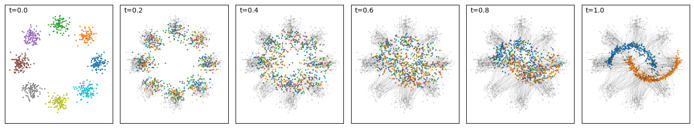

# Multimodal‑flows

Multimodal Flow for particle cloud generation with continuous and discrete modalities. The model combines conditional flow-matching for particle kinematics with Markov jump dynamics for the quantum numbers (charge and flavor) to learn real jets from CMS Open Data. This repository contains the code for the results in the paper 'Multimodal Generative Flows for LHC Jets'.

*Multimodal flow bridge evolving 8 Gaussians into 2 moons with colors. The color states are evolved with a Multivariate telegraph process.*

This repo contains:
- Self-contained MMF tutorial for 2D toy data at `/notebooks/Tutorial_Colored_8Gaussians_to_2Moons.ipynb`
- Training and sampling scripts are powered by Pytorch Lightning and Comet (required)
- Data utilities for `AspenOpenJets` (AOJ)
- Particle transformers (ParticleFormer) and EPiC encoders
- Lightning Callbacks for logging, EMA, and generation

**AspenOpenJets (AOJ) dataset**
- Default code expects AOJ `.h5` files under a base directory: `--dir <BASE>`, data in `<BASE>/aoj/RunG_batch*.h5`.
- You can let the loader download files (uses AOJ URL) by passing `download=True` in code, or manually place files under `<BASE>/aoj/`.
- Relevant loader: `multimodal_flows/utils/aoj.py` (`AspenOpenJets`).

**Training**
- Script: `scripts/train_mmf.py`
- Minimal example (set your experiment base dir):
- `python scripts/train_mmf.py --dir ./experiments --project mmf_aoj_jets --data_files RunG_batch0.h5 --batch_size 256 --max_epochs 50 --model ParticleFormer`

Key flags:
- `--dir`: Base directory for experiments and data (expects AOJ data dir `aoj/` under it)
- `--project`: Comet Project name; outputs under `<dir>/<project>/<experiment_id>`
- `--data_files`: AOJ file name(s); comma‑separated or pass multiple times
- `--num_jets`: Optional cap on jets for quicker runs
- `--model`: Encoder key registered in `networks/registry.py` (e.g., `ParticleFormer`, `FusedParticleFormer`, `EPiC`)
- `--use_ema_weights`: Enable EMA model weights during training/validation
- `--multitask_loss`: `sum`, `weighted`, or `time-weighted`

**Sampling / Generation**
- Script: `scripts/sample_mmf.py`
- Example to generate at multiple temperatures and time steps:
- `python scripts/sample_mmf.py --dir ./experiments --project jet_sequences --experiment_id <ID> --data_files RunG_batch1.h5 --num_jets 100000 --batch_size 256 --checkpoint best --num_timesteps 100 500 1000 --temperature 0.8 1.0 1.2 --tag demo`

**Citations**
- Aspen OpenJets dataset: please cite the AOJ source when using the data.
  
**License**
- Add your license of choice (e.g., MIT) in `LICENSE`.
